# LinkedIn Auto Apply - Current Implementation Flow

This document details the flow of the current auto-apply implementation based on the modular architecture.

## Overview

The current implementation follows a modular approach with separate modules for different functions. This design promotes maintainability, scalability, and separation of concerns.

## Flowchart

```mermaid
flowchart TD
    A[Start Auto Apply Process] --> B[Initialize Process]
    B --> C[Create Main Button UI]
    C --> D{User Clicks Start?}
    D -->|Yes| E[Start Auto Apply Process]
    E --> F[Load User Settings]
    F --> G[Validate API Token]
    G --> H{Token Valid?}
    H -->|Yes| I[Use AI Functions]
    H -->|No| J[Use Basic Functions]
    I --> K[Check Daily Limits]
    J --> K
    K --> L{Within Limits?}
    L -->|No| M[Show Limit Reached Message]
    L -->|Yes| N[Discover Jobs]
    N --> O[Job Discovery Module]
    O --> P[Scroll Through Job Listings]
    P --> Q[Collect Job Details]
    Q --> R[Filter Applied Jobs]
    R --> S[Filter by Company Type]
    S --> T[Process Each Job]
    T --> U{Job Already Applied?}
    U -->|Yes| V[Skip to Next Job]
    U -->|No| W[Fetch Detailed Job Info]
    W --> X[Calculate Match Score]
    X --> Y{Score >= Threshold?}
    Y -->|No| V
    Y -->|Yes| Z[Click on Job]
    Z --> AA[Find Easy Apply Button]
    AA --> AB{Easy Apply Found?}
    AB -->|No| V
    AB -->|Yes| AC[Click Easy Apply]
    AC --> AD[Run Application Process]
    AD --> AE[Application Module]
    AE --> AF[Handle Safety Reminders]
    AF --> AG[Fill Form Fields]
    AG --> AH[Handle Checkboxes]
    AH --> AI[Handle Radio Buttons]
    AI --> AJ[Handle Dropdowns]
    AJ --> AK{Review Step?}
    AK -->|Yes| AL[Process with AI]
    AK -->|No| AM[Continue to Next Step]
    AL --> AM
    AM --> AN{Submit Button?}
    AN -->|No| AO[Click Next/Review]
    AN -->|Yes| AP[Submit Application]
    AO --> AQ[Return to Application Flow]
    AQ --> AR[Close Success Modal]
    AP --> AS[Record Application]
    AS --> AT[Update Job Count]
    AT --> AU{More Jobs?}
    AU -->|Yes| T
    AU -->|No| AV[Go to Next Page]
    AV --> AW{More Pages?}
    AW -->|Yes| N
    AW -->|No| AX[Process Complete]
    V --> AU
    AX --> AY[End Process]
    M --> AZ[End Process]
```

## Key Characteristics

1. **Modular Architecture**: Separation of concerns with dedicated modules:
   - Job Discovery
   - Application Processing
   - Job Processing
   - UI Management
   - Process Control
   - Core Utilities

2. **Structured Process Flow**: Clear separation between different phases of the auto-apply process

3. **Enhanced Error Handling**: Comprehensive error handling with detailed logging and recovery mechanisms

4. **Improved UI Integration**: Better user interface with enhanced feedback and control

5. **Configurable Processing**: Dynamic loading of user settings that influence the process flow

6. **Token Validation**: Multi-level token validation to determine available features

7. **Company Filtering**: Advanced filtering based on company type (product vs service)

8. **Detailed Job Matching**: Sophisticated job matching algorithm with configurable thresholds

9. **Comprehensive Form Handling**: Complete form processing with support for various field types

10. **Application Tracking**: Detailed tracking of applications with statistics and history

11. **Pagination Support**: Multi-page job processing with automatic navigation

## Modules Overview

### Job Discovery Module
- Responsible for finding and collecting job listings
- Scrolls through LinkedIn job listings
- Filters out already applied jobs
- Categorizes companies (product vs service)

### Application Module
- Handles the actual application process
- Manages form filling for various field types
- Processes checkboxes, radio buttons, and dropdowns
- Integrates with AI services for intelligent form filling

### Job Processor Module
- Manages the overall job processing workflow
- Coordinates between job discovery and application modules
- Handles job matching logic
- Manages application state

### UI Module
- Creates and manages the user interface elements
- Provides start/stop controls
- Displays status information

### Process Module
- Controls the overall auto-apply process
- Manages starting, stopping, and pausing functionality
- Coordinates between different modules

### Core Module
- Provides shared utilities and constants
- Manages delays to simulate human behavior
- Handles common DOM operations

## Advantages Over Legacy Implementation

1. **Maintainability**: Modular design makes it easier to maintain and update individual components
2. **Scalability**: New features can be added with minimal impact on existing code
3. **Testability**: Clear separation of concerns enables easier unit testing
4. **Debugging**: Better logging and error handling facilitate debugging
5. **Extensibility**: Modular architecture allows for easy extension with new features
6. **Collaboration**: Multiple developers can work on different modules simultaneously
7. **Code Reuse**: Shared utilities and components reduce code duplication