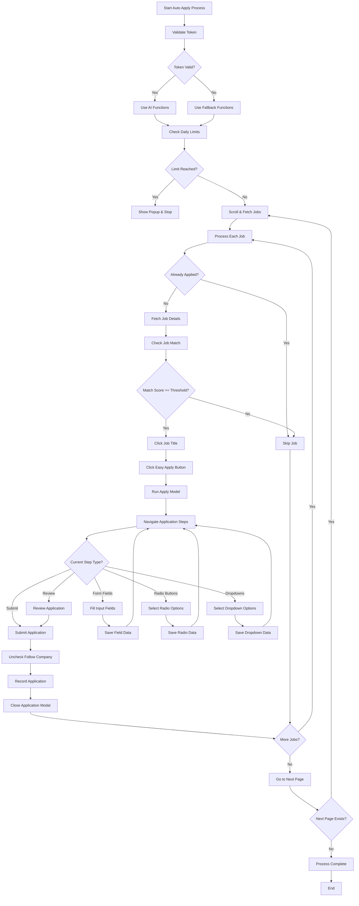

# LinkedIn Auto Apply - Legacy Implementation Flow

This document details the flow of the legacy auto-apply implementation based on the converted TypeScript code.

## Overview

The legacy implementation is a monolithic approach where all functionality exists in a single file. The process follows a linear path with deeply nested functions.

## Flowchart

## Key Characteristics

1. **Monolithic Architecture**: All functionality exists in a single large file
2. **Linear Process Flow**: Deeply nested function calls with limited modularity
3. **Basic Error Handling**: Simple try/catch blocks for error management
4. **Direct DOM Manipulation**: Heavy reliance on direct DOM element selection and manipulation
5. **Token Validation**: Initial token validation determines which functions to use (AI vs fallback)
6. **Daily Limits**: Checks daily application limits before processing jobs
7. **Job Matching**: Uses AI-powered job matching to determine if a job should be applied to
8. **Form Filling**: Comprehensive form filling with multiple field types (inputs, radios, dropdowns)
9. **Application Recording**: Tracks applied jobs in local storage
10. **Pagination**: Processes jobs across multiple pages

## Limitations

1. **Maintainability**: Difficult to maintain due to the monolithic structure
2. **Extensibility**: Hard to extend with new features
3. **Debugging**: Challenging to debug specific parts of the process
4. **Testing**: No clear separation of concerns makes unit testing difficult