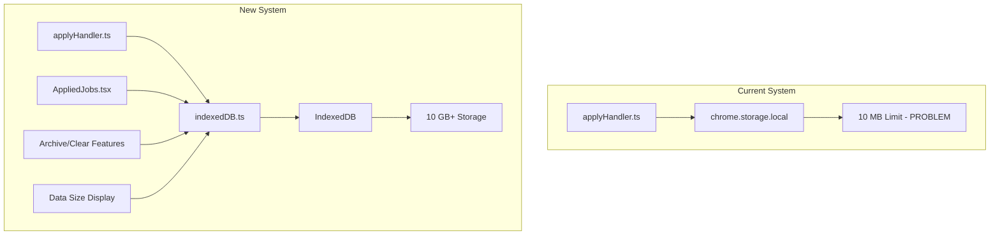
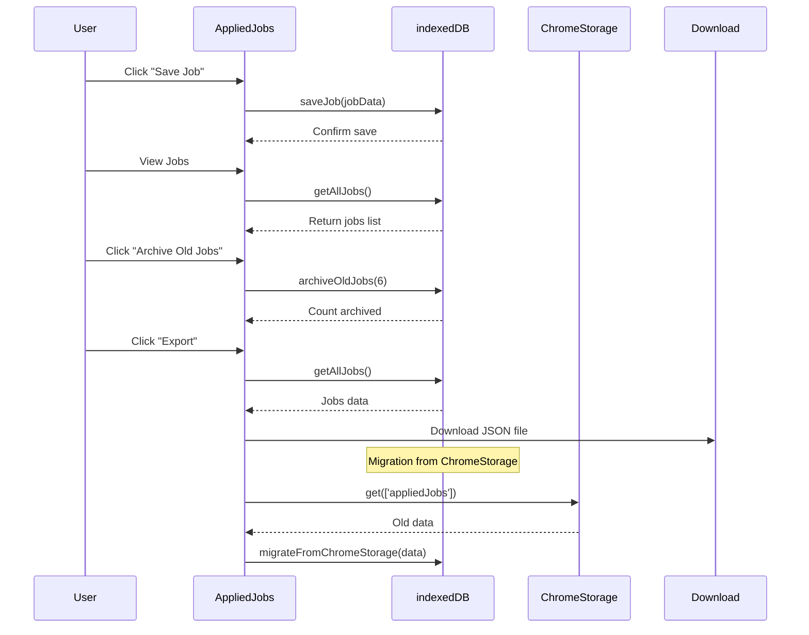

# IndexedDB Implementation Plan for Applied Jobs

## Overview

Migrate applied jobs storage from `chrome.storage.local` (~10 MB limit) to **IndexedDB** (GBs of storage) with features for data management, size display, and archiving.

---

## Architecture



---

## Implementation Steps

### Phase 1: Core IndexedDB Utility

**File: `src/utils/indexedDB.ts`**

```typescript
// Database configuration
const DB_NAME = 'AppliedJobsDB';
const DB_VERSION = 1;
const STORE_NAME = 'jobs';

interface AppliedJob {
  id: string;              // unique: `${company}-${appliedDate}`
  jobTitle: string;
  company: string;
  location: string;
  appliedDate: string;
  applicationFormData?: any;
  archived?: boolean;
  createdAt: number;       // timestamp for sorting/archiving
}

// initDB() - Initialize database
// saveJob(job: AppliedJob) - Save single job
// getAllJobs() - Get all non-archived jobs
// getJobById(id: string) - Get single job
// deleteJob(id: string) - Delete single job
// getStorageSize() - Calculate total storage size
// archiveOldJobs(months: number) - Archive jobs older than N months
// clearOldJobs(months: number) - Permanently delete old jobs
// migrateFromChromeStorage(data: any) - Import from chrome.storage.local
```

---

### Phase 2: Update applyHandler.ts

**File: `src/content/applyHandler.ts`**

Modify `saveAppliedJob()` function:

```typescript
export async function saveAppliedJob(jobDetails: any) {
  // ... existing logic ...
  
  // Change from:
  // await chrome.storage.local.set({ appliedJobs });
  
  // To:
  await saveJob({
    id: `${jobDetails.company}-${isoDate}`,
    ...jobDetails,
    appliedDate: isoDate,
    applicationFormData: applicationFormData || null,
    archived: false,
    createdAt: Date.now()
  });
}
```

---

### Phase 3: Update AppliedJobs.tsx

**File: `src/popup/components/AppliedJobs.tsx`**

1. Import IndexedDB utilities
2. Replace `chrome.storage.local.get()` with IndexedDB calls
3. Add storage size display
4. Add archive/clear buttons

```tsx
// New state
const [storageSize, setStorageSize] = useState<string>('0 KB');

// Load jobs from IndexedDB
useEffect(() => {
  getAllJobs().then(jobs => {
    setAppliedJobs(jobs);
    setFilteredJobs(jobs);
  });
  
  // Load storage size
  getStorageSize().then(size => {
    setStorageSize(formatBytes(size));
  });
}, []);

// New UI elements
<div className="storage-info">
  <span>Storage Used: {storageSize}</span>
  <button onClick={handleArchiveOldJobs}>Archive Old Jobs</button>
  <button onClick={handleClearOldJobs}>Clear Old Jobs</button>
  <button onClick={handleExportJobs}>Export to JSON</button>
</div>
```

---

### Phase 4: Archive & Clear Features

**New Functions in `src/utils/indexedDB.ts`:**

```typescript
// Archive jobs older than N months (marks as archived, keeps data)
export async function archiveOldJobs(months: number): Promise<number> {
  const cutoff = Date.now() - (months * 30 * 24 * 60 * 60 * 1000);
  const jobs = await getAllJobs();
  let archived = 0;
  
  for (const job of jobs) {
    if (job.createdAt < cutoff && !job.archived) {
      await updateJob(job.id, { archived: true });
      archived++;
    }
  }
  return archived;
}

// Permanently delete old jobs (user action for cleanup)
export async function clearOldJobs(months: number): Promise<number> {
  const cutoff = Date.now() - (months * 30 * 24 * 60 * 60 * 1000);
  const jobs = await getAllJobs();
  let deleted = 0;
  
  for (const job of jobs) {
    if (job.createdAt < cutoff) {
      await deleteJob(job.id);
      deleted++;
    }
  }
  return deleted;
}

// Get only archived jobs
export async function getArchivedJobs(): Promise<AppliedJob[]> {
  const jobs = await getAllJobs();
  return jobs.filter(j => j.archived);
}
```

---

### Phase 5: Export Feature

**File: `src/utils/export.ts`**

```typescript
export async function exportJobsToJSON(): Promise<void> {
  const jobs = await getAllJobs();
  const blob = new Blob([JSON.stringify(jobs, null, 2)], { 
    type: 'application/json' 
  });
  const url = URL.createObjectURL(blob);
  
  chrome.downloads.download({
    url: url,
    filename: `applied-jobs-${new Date().toISOString().split('T')[0]}.json`,
    saveAs: true
  });
}
```

---

### Phase 6: UI for Archive/Clear

**File: `src/popup/components/AppliedJobs.tsx`**

Add management section:

```tsx
<div className="data-management">
  <h3>Data Management</h3>
  
  <div className="storage-usage">
    <div className="usage-bar">
      <div 
        className="usage-fill" 
        style={{ width: `${calculateUsagePercent()}%` }}
      />
    </div>
    <span>{storageSize} used</span>
  </div>
  
  <div className="management-actions">
    <button onClick={() => handleArchiveOldJobs(6)}>
      Archive Jobs Older Than 6 Months
    </button>
    <button onClick={() => handleClearOldJobs(12)}>
      Permanently Delete Jobs Older Than 1 Year
    </button>
    <button onClick={handleExportJobs}>
      Export All Jobs to JSON
    </button>
    <button onClick={handleViewArchivedJobs}>
      View Archived Jobs
    </button>
  </div>
</div>
```

---

## Data Flow



---

## Migration Strategy

1. **On first run with new IndexedDB system:**
   - Check if `appliedJobs` exists in `chrome.storage.local`
   - If yes, prompt user: "Migrate existing data to new storage?"
   - If user agrees, import all jobs to IndexedDB
   - Optionally clear old chrome.storage.local data after migration

2. **Backward compatibility:**
   - Keep reading from chrome.storage.local as fallback
   - Gradually move all reads/writes to IndexedDB

---

## File Changes Summary

| File | Action | Description |
|------|--------|-------------|
| `src/utils/indexedDB.ts` | Create | Core IndexedDB operations |
| `src/utils/export.ts` | Create | Export functionality |
| `src/content/applyHandler.ts` | Modify | Use IndexedDB instead of chrome.storage.local |
| `src/popup/components/AppliedJobs.tsx` | Modify | Load from IndexedDB, add size display & management |
| `src/types/index.ts` | Modify | Add/update AppliedJob interface |

---

## Benefits

| Feature | Before | After |
|---------|--------|-------|
| Storage limit | ~10 MB | ~50% of disk (GBs) |
| Data size display | ❌ | ✅ |
| Archive old jobs | ❌ | ✅ |
| Clear old jobs | ❌ | ✅ |
| Export to JSON | ❌ | ✅ |
| Query by date | Manual | Indexed |

---

## Next Steps

1. Create `src/utils/indexedDB.ts` with core database operations
2. Create `src/utils/export.ts` for JSON export
3. Modify `src/content/applyHandler.ts` to use IndexedDB
4. Update `src/popup/components/AppliedJobs.tsx` with new features
5. Add migration from chrome.storage.local
6. Test with existing data
